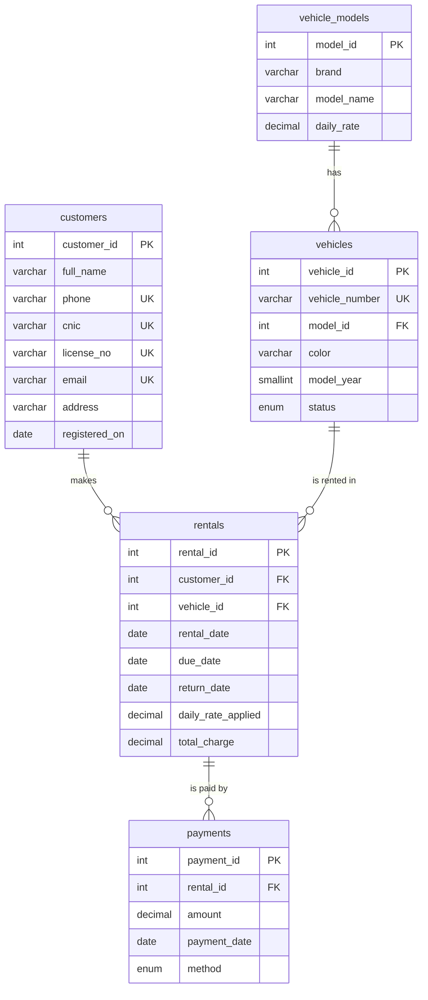

# 🚗 CarGo Rentals — Car Rental Management System

A relational database for a local car rental company, designed and implemented in **MariaDB** (XAMPP + phpMyAdmin). It replaces spreadsheet-based record keeping with a normalized (3NF) schema, and provides JOIN reports, a reporting view, triggers that prevent double-booking, a stored procedure for registering rentals, and an indexing/optimization analysis.

## 📑 Table of Contents

1. [Problem Statement](#-problem-statement)
2. [Features](#-features)
3. [Tech Stack](#-tech-stack)
4. [Database Design](#-database-design)
5. [Normalization](#-normalization)
6. [Sample Data](#-sample-data)
7. [JOIN Queries](#-join-queries)
8. [View](#-view-vw_rental_report)
9. [Triggers](#-triggers)
10. [Stored Procedure](#-stored-procedure-sp_register_rental)
11. [Optimization Analysis](#-optimization-analysis)
12. [Getting Started](#-getting-started)
13. [Repository Structure](#-repository-structure)
14. [Author](#-author)

---

## 📌 Problem Statement

CarGo Rentals rents vehicles to customers on a daily or weekly basis. Customer, vehicle, rental, return and payment data were kept in spreadsheets, which led to duplicate information, inconsistent records and difficulty generating reports.

This project replaces the spreadsheets with a relational database that:

- stores customers and vehicles,
- records rentals and returns,
- calculates rental charges,
- keeps payment information (including instalments),
- prevents a vehicle from being rented while it is already rented, and
- provides the management reports requested in the scenario.

## ✨ Features

- **5 normalized tables** with primary keys, foreign keys, `UNIQUE`, `NOT NULL`, `DEFAULT` and `CHECK` constraints
- **Full 3NF normalization** with documented 1NF → 2NF → 3NF steps and anomaly analysis
- **4 JOIN queries** (`INNER JOIN` and `LEFT JOIN`) answering real business questions
- **Reporting view** `vw_rental_report` with paid amount, balance due, rental status and payment status
- **3 triggers** that enforce the "no double rental" rule and keep `vehicles.status` in sync automatically
- **Stored procedure** `sp_register_rental` with validation, automatic charge calculation, advance payment and transaction handling
- **Optimization analysis** using `EXPLAIN`, a non-sargable `YEAR()` filter, and an index + range-query rewrite

## 🛠 Tech Stack

| Tool | Purpose |
|------|---------|
| MariaDB | Database engine (InnoDB, `utf8mb4_general_ci`) |
| XAMPP (Apache + MariaDB) | Local server environment |
| phpMyAdmin | Administration, Designer view, query execution |

---

## 🗂 Database Design

### Entity relationships



### Tables, keys and constraints

| Table | Purpose | Primary key | Foreign keys | Main constraints |
|-------|---------|-------------|--------------|------------------|
| `customers` | Customer identity, contact and licence details | `customer_id` | — | `NOT NULL` on name, phone, CNIC, licence; `UNIQUE` on phone, CNIC, `licence_no`, email; `DEFAULT` current date for `registered_on` |
| `vehicle_models` | Brand, model name and standard daily rate | `model_id` | — | `UNIQUE (brand, model_name)`; `CHECK daily_rate > 0` |
| `vehicles` | Individual cars of the fleet | `vehicle_id` | `model_id → vehicle_models` | `UNIQUE vehicle_number`; `CHECK model_year` 2000–2035; `status` ENUM (`Available`, `Rented`, `Maintenance`) default `Available` |
| `rentals` | Each rental and its return | `rental_id` | `customer_id → customers`, `vehicle_id → vehicles` | `CHECK due_date > rental_date`; `CHECK return_date IS NULL OR ≥ rental_date`; `CHECK` rate and total > 0 |
| `payments` | Payments made against a rental | `payment_id` | `rental_id → rentals` | `CHECK amount > 0`; `method` ENUM (`Cash`, `Card`, `Bank Transfer`, `Mobile Wallet`) default `Cash`; `DEFAULT` current date for `payment_date` |

### Design decisions

- **`vehicle_models` is separate** — the daily rate depends on the model, not the individual car. A rate change is a single-row update.
- **`payments` is separate** — a rental can be paid in several payments (advance + balance).
- **`daily_rate_applied` and `total_charge` are stored in `rentals`** — old rentals keep the price agreed at booking time even if the model's rate changes later.
- **`return_date` is `NULL` while the car is out** — "currently rented" is simply `return_date IS NULL`; no extra returns table is needed for a one-to-one relationship.
- **Foreign keys use `ON DELETE RESTRICT` / `ON UPDATE CASCADE`** — customers and vehicles with rental history can't be deleted by mistake.
- **`vehicles.status` is a fast availability flag** maintained automatically by triggers so it can't drift from the rental data.

---

## 📐 Normalization

The company originally stored each rental as one wide record:

`RentalID | CustomerName | CustomerPhone | VehicleNumber | VehicleModel | DailyRate | RentalDate | ReturnDate | PaymentAmount`

| Normal form | Problem found | Fix |
|-------------|---------------|-----|
| **1NF** | `VehicleModel` holds two facts ("Toyota Corolla"); one `PaymentAmount` cannot hold several instalments | Split into `Brand` / `Model`; move payments into their own relation |
| **2NF** | Both `Rental` and `Payment` have single-attribute keys, so no partial dependencies. In the extended case of several vehicles per rental, a `RentalVehicle` junction table would be needed | Already in 2NF (junction-table design documented for future extension) |
| **3NF** | Transitive dependencies: `RentalID → CustomerPhone → CustomerName` and `RentalID → VehicleNumber → Model → DailyRate` | Extract `customers`, `vehicle_models` and `vehicles` with surrogate keys |

### Anomalies removed

| Anomaly | Problem in the single-record structure | 3NF fix |
|---------|----------------------------------------|---------|
| Insertion | A new customer/vehicle can't be stored until a rental exists | Customers, models and vehicles stored independently |
| Update | Changing a rate or phone number means updating many rows | Stored once in `vehicle_models` / `customers` |
| Deletion | Deleting a customer's only rental deletes customer and vehicle data | Deleting a rental never removes customer/vehicle data |
| Redundancy | Name, phone, model and rate repeated in every rental | Each fact stored once and referenced by key |

---

## 🧪 Sample Data

| Table | Rows |
|-------|------|
| `customers` | 8 |
| `vehicle_models` | 6 |
| `vehicles` | 8 |
| `rentals` | 11 (8 completed, 3 active) |
| `payments` | 12 |

The data deliberately includes two customers who have never rented (for `LEFT JOIN` queries), a vehicle under maintenance that was never rented, a rental paid in two instalments, active rentals with only an advance paid, and a 2025 rental to make date-range queries meaningful.

---

## 🔗 JOIN Queries

| # | Business question | Join used |
|---|-------------------|-----------|
| 1 | Every rental with customer name, vehicle number, model, rental date and return date | `INNER JOIN` across `rentals`, `customers`, `vehicles`, `vehicle_models` |
| 2 | All customers and the vehicles they rented (including customers who never rented) | `LEFT JOIN` starting from `customers` |
| 3 | All vehicles with their **current** rental (including vehicles not rented now) | `LEFT JOIN` from `vehicles`, with `return_date IS NULL` placed in the `ON` clause |
| 4 | Total rentals per customer (including 0) | `LEFT JOIN` + `GROUP BY` with `COUNT(r.rental_id)` |

<details>
<summary><b>Query 3 — all vehicles with their current rental</b></summary>

```sql
SELECT v.vehicle_number,
       CONCAT(m.brand, ' ', m.model_name) AS vehicle_model,
       v.status,
       c.full_name AS rented_by,
       r.rental_date,
       r.due_date
FROM vehicles v
INNER JOIN vehicle_models m ON m.model_id = v.model_id
LEFT JOIN rentals r   ON r.vehicle_id = v.vehicle_id AND r.return_date IS NULL
LEFT JOIN customers c ON c.customer_id = r.customer_id
ORDER BY v.vehicle_id;
```

> The `return_date IS NULL` condition is in the `ON` clause, not `WHERE`. In `WHERE` it would filter out available vehicles.
</details>

<details>
<summary><b>Query 4 — total rentals per customer</b></summary>

```sql
SELECT c.customer_id,
       c.full_name AS customer_name,
       COUNT(r.rental_id) AS total_rentals
FROM customers c
LEFT JOIN rentals r ON r.customer_id = c.customer_id
GROUP BY c.customer_id, c.full_name
ORDER BY total_rentals DESC, c.customer_id;
```

> `COUNT(r.rental_id)` is used instead of `COUNT(*)`, which would wrongly report 1 for customers with no rentals.
</details>

---

## 👁 View: `vw_rental_report`

Combines customer, vehicle, rental and payment data into one report. It calculates:

- `rental_days` — `DATEDIFF(due_date, rental_date)`
- `amount_paid` — sum of all payments for the rental
- `balance_due` — `total_charge − amount_paid` (never stored, so it can't go stale)
- `rental_status` — `Active` / `Completed`
- `payment_status` — `Paid` / `Partially Paid` / `Unpaid`

```sql
-- All rentals with paid amount and balance
SELECT * FROM vw_rental_report ORDER BY rental_id;

-- Active rentals with a pending balance
SELECT * FROM vw_rental_report
WHERE rental_status = 'Active' AND balance_due > 0;
```

---

## ⚡ Triggers

Business rule: **a vehicle must not be rented while it is already rented.** Enforced inside the database, so it holds regardless of which application inserts the data.

| Trigger | Event | Action |
|---------|-------|--------|
| `trg_prevent_double_rental` | `BEFORE INSERT` on `rentals` | Rejects a new active rental (SQLSTATE `45000`) if the vehicle status is not `Available` |
| `trg_mark_vehicle_rented` | `AFTER INSERT` on `rentals` | Sets vehicle status to `Rented` after a successful active rental |
| `trg_mark_vehicle_available` | `AFTER UPDATE` on `rentals` | When `return_date` is filled in, sets vehicle status back to `Available` |

**Tests**

```sql
-- Test 1: vehicle already rented  -> must FAIL
INSERT INTO rentals (customer_id, vehicle_id, rental_date, due_date, daily_rate_applied, total_charge)
VALUES (7, 1, '2026-09-20', '2026-09-22', 5000.00, 10000.00);

-- Test 2: vehicle under maintenance -> must FAIL
INSERT INTO rentals (customer_id, vehicle_id, rental_date, due_date, daily_rate_applied, total_charge)
VALUES (7, 8, '2026-09-20', '2026-09-22', 6500.00, 13000.00);
```

Both return: `#1644 - Rental rejected: vehicle is not available (already rented or under maintenance).`

---

## ⚙️ Stored Procedure: `sp_register_rental`

Registers a new rental, calculates the charge and optionally records an advance payment.

```sql
CALL sp_register_rental(p_customer_id, p_vehicle_id, p_rental_date, p_days, p_advance, p_method);
```

| Parameter | Type | Meaning |
|-----------|------|---------|
| `p_customer_id` | INT | Customer making the rental |
| `p_vehicle_id` | INT | Vehicle to be rented |
| `p_rental_date` | DATE | Start date |
| `p_days` | INT | Number of rental days |
| `p_advance` | DECIMAL(10,2) | Advance payment (0 if none) |
| `p_method` | VARCHAR(20) | Cash, Card, Bank Transfer, Mobile Wallet |

**Logic**

- **Validation:** days ≥ 1; customer must exist; vehicle must exist; advance between 0 and total charge
- **Calculation:** `due_date = rental_date + days`, `total_charge = daily_rate × days` (rate read via `vehicles` → `vehicle_models`)
- **Database work:** inserts the rental (triggers block unavailable vehicles and mark the vehicle `Rented`) and inserts the advance payment
- **Transaction:** wrapped in a transaction with an exit handler that rolls back and re-raises any error
- **Output:** returns a summary row (rental id, due date, total charge, advance paid, balance due)

**Example**

```sql
-- Zain Abbas rents a Suzuki Cultus (3500/day) for 3 days with a 5000 advance
CALL sp_register_rental(7, 4, '2026-09-20', 3, 5000.00, 'Cash');
-- Expected: total_charge = 10500.00, balance_due = 5500.00, due_date = 2026-09-23

-- Return the vehicle -> trigger sets status back to 'Available'
UPDATE rentals SET return_date = '2026-09-23'
WHERE vehicle_id = 4 AND return_date IS NULL;

SELECT vehicle_number, status FROM vehicles WHERE vehicle_id = 4;
```

**Failure cases**

```sql
CALL sp_register_rental(8, 4, '2026-09-20', 2, 0, 'Cash');   -- vehicle already rented (trigger error)
CALL sp_register_rental(8, 5, '2026-09-20', 0, 0, 'Cash');   -- 0 days -> "Rental period must be at least 1 day."
CALL sp_register_rental(99, 5, '2026-09-20', 2, 0, 'Cash');  -- "Customer does not exist."
```

---

## 🚀 Optimization Analysis

**Problem:** "Which rentals were made in 2026?" written naturally applies a function to the column:

```sql
SELECT rental_id, customer_id, rental_date, total_charge
FROM rentals
WHERE YEAR(rental_date) = 2026;
```

`YEAR()` makes the condition **non-sargable** — the database can't use an index on `rental_date` and must scan every row. Adding an index alone does not fix this.

**Improvement:** index the column *and* rewrite the filter as a half-open date range:

```sql
CREATE INDEX idx_rentals_rental_date ON rentals (rental_date);

SELECT rental_id, customer_id, rental_date, total_charge
FROM rentals
WHERE rental_date >= '2026-01-01' AND rental_date < '2027-01-01';
```

| Step | Query form | What to look for in `EXPLAIN` |
|------|------------|-------------------------------|
| Before | `YEAR(rental_date) = 2026`, no index | `type = ALL`, `key = NULL` (full table scan) |
| Index only | `YEAR(rental_date) = 2026`, index exists | Still a scan — the function hides the column |
| After | Range on `rental_date`, index exists | `possible_keys = idx_rentals_rental_date`; `type = range` when chosen |

> With only 11 sample rows the optimizer may still choose a full scan; the key point is that the rewritten query *can* use the index while the `YEAR()` version never can.

### Data consistency safeguards

- `vehicles.status` is derived data — updated only by triggers; the `BEFORE INSERT` trigger blocks double rentals.
- `rentals.total_charge` is calculated in one place (the stored procedure) and protected by `CHECK` constraints.
- Balance due is **not stored** — it is computed by the view, so it can never become stale.


## 📁 Repository Structure

cargo-rentals/
├── cargo_rentals.sql              # Complete SQL script (schema, data, view, triggers, procedure)
├── CarGo_Rentals_Lab_Report.pdf   # Full lab report with screenshots
└── README.md

## 👤 Author

**Jawahir Ali** — Roll No. `2024-SE-34`
Instructor: Engr. Muhammad Awais
Course: Database Management System (Lab)
